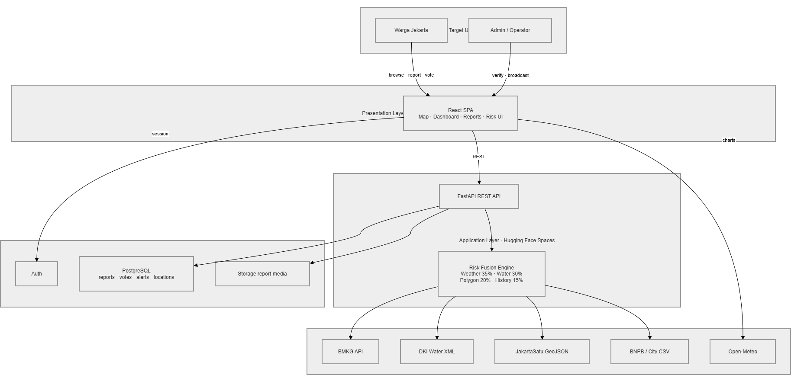

# BanSos - Flood Risk & Community Report System

BanSos adalah website untuk membantu pengguna memantau risiko banjir di sekitar Jakarta. Melalui website ini, pengguna bisa membuat laporan kejadian banjir dan melihat informasi laporan dari warga lain berdasarkan lokasi pengguna tersebut. Project ini dibuat supaya informasi banjir tidak hanya datang dari satu sumber, tetapi juga bisa dibantu oleh laporan komunitas / pengguna sekitar, yang kemudian laporan tersebut diverifikasi oleh admin.

Secara singkat, website ini memungkinkan pengguna untuk: login, memilih lokasi, melihat analisis risiko banjir, membuat laporan banjir dengan foto/video, dan menyimpan lokasi penting. Di bagian admin, admin bisa melihat laporan yang masuk setelah itu bisa dicek, disetujui, ditolak, dan admin juga bisa mengirim broadcast alert ke area tertentu.

---

## Project Demo

Link: https://ban-sos.vercel.app/

---
## 🏗️ System Architecture

Diagram berikut menunjukkan gambaran umum arsitektur sistem BanSos, mulai dari user dan admin yang mengakses frontend, frontend yang terhubung ke backend FastAPI, sampai backend yang menggunakan Supabase, external API, dan deployment services.

<p align="center">
  
</p>

Secara umum, frontend BanSos dibangun menggunakan React + Vite dan dideploy melalui Vercel. Backend menggunakan FastAPI dan dijalankan melalui Hugging Face Spaces. Supabase digunakan untuk authentication, database, dan storage, sedangkan data cuaca atau prakiraan hujan diambil dari external API seperti Open-Meteo.

---

## Fitur Utama

### Untuk User

- Login, register, verifikasi email, dan reset password menggunakan Supabase Auth.
- Dashboard untuk melihat kondisi lokasi yang dipilih user.
- Peta yang interaktif menggunakan Leaflet untuk melihat posisi dan laporan sekitar.
- Analisis risiko banjir berdasarkan koordinat lokasi pengguna.
- Membuat laporan banjir dengan judul, deskripsi, tingkat keparahan, lokasi, dan media pendukung.
- Melihat daftar laporan kejadian banjir dari komunitas.
- Melihat detail laporan dan memberi konfirmasi pada laporan.
- Melihat laporan milik sendiri di halaman My Reports, termasuk rating berdasarkan kontribusi laporan yang telah dibuat.
- Menyimpan lokasi penting seperti rumah, kampus, kantor, atau lokasi lain.
- Mengatur notification preferences untuk laporan yang disetujui, ditolak, dan laporan sekitar.
- Mendukung tampilan light mode dan dark mode.

### Untuk Admin

- Login khusus admin.
- Admin portal untuk melihat ringkasan data.
- Verifikasi laporan yang masuk dari user.
- Approve atau reject laporan beserta alasan penolakan.
- Membuat broadcast alert berdasarkan lokasi dan radius tertentu.
- Melihat jumlah laporan pending, approved, rejected, dan broadcast yang sudah dibuat.

---

## Tech Stack

### Frontend

- React — library utama untuk membangun tampilan website.
- Vite — build tool dan development server.
- TypeScript — membantu membuat code lebih aman dan mudah dikelola.
- Tailwind CSS — digunakan untuk styling tampilan website.
- React Router — mengatur routing antar halaman.
- Leaflet dan React Leaflet — menampilkan peta yang interaktif.
- Supabase Client — menghubungkan frontend dengan Supabase.
- Lucide React — icon.
- Radix UI — komponen UI tambahan.
- Recharts — chart dan visualisasi data.

### Backend

- FastAPI — framework utama untuk membuat backend API.
- Python — bahasa utama yang digunakan di backend khususnya di FastAPI.
- Uvicorn — server untuk menjalankan backend FastAPI.
- Pandas — pengolahan data.
- GeoPandas — pengolahan data geospasial.
- Shapely — operasi geometri dan koordinat.
- Requests — mengambil data dari API eksternal.
- Supabase Python Client — menghubungkan backend dengan Supabase.

### Database & Services

- Supabase Authentication — login, register, verifikasi email, dan reset password.
- Supabase Database — menyimpan data aplikasi seperti reports, saved locations, dan broadcast alerts.
- Supabase Storage — menyimpan media laporan seperti foto atau video.
- Supabase Row Level Security — mengatur akses data agar lebih aman.
- Open-Meteo API — mengambil data prakiraan hujan/cuaca.

### Deployment

- Frontend: Vercel
- Backend: Hugging Face Spaces menggunakan Docker
- Database/Auth/Storage: Supabase

---

## Struktur Folder

Struktur utama project ini seperti berikut:

```txt
BanSos/
├── backend/
│   ├── datasource/
│   │   ├── clean/
│   │   ├── processed/
│   │   └── raw/
│   ├── src/
│   │   ├── api/
│   │   │   └── main.py
│   │   ├── database/
│   │   │   └── supabase_client.py
│   │   ├── data_cleaning/
│   │   ├── feature_engineering/
│   │   └── risk_engine/
│   ├── Dockerfile
│   ├── requirements.txt
│   └── README.md
│
├── frontend/
│   ├── src/
│   │   ├── app/
│   │   │   ├── components/
│   │   │   ├── context/
│   │   │   ├── data/
│   │   │   ├── pages/
│   │   │   ├── routes/
│   │   │   ├── services/
│   │   │   └── utils/
│   │   ├── styles/
│   │   └── main.tsx
│   ├── index.html
│   ├── package.json
│   ├── tsconfig.json
│   ├── vercel.json
│   └── vite.config.ts
│
├── supabase/
│   └── schema.sql
│
├── ATTRIBUTIONS.md
├── .gitignore
└── README.md
```

Penjelasan singkat:

- `frontend/` berisi semua code tampilan website.
- `backend/` berisi API FastAPI untuk risk analysis, reports, saved locations, notifications, dan admin features.
- `backend/datasource/` berisi data banjir yang dipakai untuk proses analisis risiko.
- `supabase/schema.sql` berisi query SQL untuk membuat tabel dan konfigurasi database Supabase.

---

## Cara Install dan Run Project

### 1. Clone Repository

```bash
git clone https://github.com/username/nama-repository.git
cd nama-repository
```

Ganti `username/nama-repository` dengan repository GitHub yang dipakai.

---

## Menjalankan Frontend

Masuk ke folder frontend:

```bash
cd frontend
```

Install dependency:

```bash
npm install
```

Buat file `.env` di dalam folder `frontend/`:

```env
VITE_API_BASE_URL=http://localhost:8000
VITE_SUPABASE_URL=your_supabase_project_url
VITE_SUPABASE_ANON_KEY=your_supabase_anon_key
```

Jalankan frontend:

```bash
npm run dev
```

Biasanya frontend akan berjalan di:

```txt
http://localhost:5173
```

---

## Menjalankan Backend

Masuk ke folder backend:

```bash
cd backend
```

Buat virtual environment:

```bash
python -m venv .venv
```

Aktifkan virtual environment.

Untuk Windows:

```bash
.venv\Scripts\activate
```

Untuk macOS/Linux:

```bash
source .venv/bin/activate
```

Install dependency:

```bash
pip install -r requirements.txt
```

Buat file `.env` di dalam folder `backend/`:

```env
SUPABASE_URL=your_supabase_project_url
SUPABASE_SERVICE_ROLE_KEY=your_supabase_service_role_key
CORS_ORIGINS=http://localhost:5173
```

Jalankan backend:

```bash
uvicorn src.api.main:app --reload
```

Biasanya backend akan berjalan di:

```txt
http://localhost:8000
```

Untuk mengecek backend hidup atau tidak, buka:

```txt
http://localhost:8000/
```

Jika berhasil, akan muncul response seperti:

```json
{
  "message": "BANSOS Flood Risk API is running."
}
```

---

## Environment Variables

### Frontend `.env`

File ini dibuat di folder `frontend/`.

```env
VITE_API_BASE_URL=
VITE_SUPABASE_URL=
VITE_SUPABASE_ANON_KEY=
```

Keterangan:

- `VITE_API_BASE_URL` adalah URL backend FastAPI.
- `VITE_SUPABASE_URL` adalah URL project Supabase.
- `VITE_SUPABASE_ANON_KEY` adalah public anon key dari Supabase.

Contoh local:

```env
VITE_API_BASE_URL=http://localhost:8000
VITE_SUPABASE_URL=https://your-project.supabase.co
VITE_SUPABASE_ANON_KEY=your_anon_key
```

### Backend `.env`

File ini dibuat di folder `backend/`.

```env
SUPABASE_URL=
SUPABASE_SERVICE_ROLE_KEY=
CORS_ORIGINS=
```

Keterangan:

- `SUPABASE_URL` adalah URL project Supabase.
- `SUPABASE_SERVICE_ROLE_KEY` adalah service role key dari Supabase. Key ini hanya boleh dipakai di backend.
- `CORS_ORIGINS` berisi daftar domain frontend yang boleh mengakses backend.

Contoh local:

```env
SUPABASE_URL=https://your-project.supabase.co
SUPABASE_SERVICE_ROLE_KEY=your_service_role_key
CORS_ORIGINS=http://localhost:5173
```

Jika sudah deploy frontend, isi `CORS_ORIGINS` dengan domain production juga, misalnya:

```env
CORS_ORIGINS=https://nama-project.vercel.app
```

Kalau ada lebih dari satu domain, pisahkan dengan koma:

```env
CORS_ORIGINS=http://localhost:5173,https://nama-project.vercel.app
```

> Jangan upload file `.env` ke GitHub. Simpan `.env` hanya di local atau di environment variables platform deployment.

---

## Informasi Supabase

Project ini memakai Supabase untuk auth, database, dan storage.

### 1. Authentication

Supabase Auth dipakai untuk:

- Register user
- Login user
- Verify email
- Reset password
- Session user

### 2. Database

File database ada di:

```txt
supabase/schema.sql
```

Jalankan isi file tersebut di Supabase SQL Editor untuk membuat tabel yang dibutuhkan.

Tabel utama yang dipakai:

- `reports` untuk menyimpan laporan banjir dari user.
- `report_media` untuk menyimpan URL foto/video pendukung laporan.
- `report_verifications` untuk menyimpan keputusan admin terhadap laporan.
- `broadcast_alerts` untuk menyimpan alert yang dibuat admin.
- `saved_locations` untuk menyimpan lokasi favorit user.
- `notification_preferences` untuk menyimpan pengaturan notifikasi user.

Backend juga memiliki fitur voting/konfirmasi laporan. Jika fitur confirm/deny dipakai, pastikan tabel `report_votes` juga tersedia di Supabase karena backend membaca dan menyimpan vote laporan melalui tabel tersebut.

### 3. Storage

Project ini memakai Supabase Storage untuk menyimpan media laporan.

Bucket yang digunakan:

```txt
report-media
```

File `schema.sql` sudah menyiapkan bucket `report-media` sebagai public bucket dan membuat policy untuk public read media.

Upload media dilakukan lewat backend menggunakan service role key, jadi service role key hanya boleh disimpan di backend, bukan di frontend.

---

## Status Project

Project ini dibuat untuk kebutuhan Software Engineering dengan fokus pada sistem informasi risiko banjir, laporan komunitas, dan admin verification. Sistem ini masih bisa dikembangkan lagi, terutama untuk real-time notification, role management yang lebih rapi, dan integrasi data banjir yang lebih lengkap.

---

## Contributors

1. Randy Salim
2. Dzaky Rizha Anargya
3. Jevon Justin
4. Alif Akbar Hafiz

---
