# 🌊 BanSos - Flood Risk & Community Report System

BanSos adalah website untuk membantu pengguna memantau risiko banjir di sekitar Jakarta. Melalui website ini, pengguna bisa membuat laporan kejadian banjir dan melihat informasi laporan dari warga lain berdasarkan lokasi pengguna tersebut. Project ini dibuat supaya informasi banjir tidak hanya datang dari satu sumber, tetapi juga bisa dibantu oleh laporan komunitas / pengguna sekitar, yang kemudian laporan tersebut diverifikasi oleh admin.

Secara singkat, website ini memungkinkan pengguna untuk: login, memilih lokasi, melihat analisis risiko banjir, membuat laporan banjir dengan foto/video, dan menyimpan lokasi penting. Di bagian admin, admin bisa melihat laporan yang masuk setelah itu bisa dicek, disetujui, ditolak, dan admin juga bisa mengirim broadcast alert ke area tertentu.

---

## 🚀 Project Demo

Link: https://ban-sos.vercel.app/

---

## 📌 Overview

- **Name**: BanSos
- **Type**: Flood Risk Monitoring & Community Report System
- **Focus**: Flood risk analysis, community reporting, and admin verification
- **Target Area**: Jakarta
- **Main Users**: Public users and admin/verifier
- **Frontend**: React + Vite
- **Backend**: FastAPI
- **Database/Auth/Storage**: Supabase
  
---

## 🔥 Features

### 👤 Untuk User

- Login, register, verifikasi email, dan reset password menggunakan Supabase Auth.
- Dashboard untuk melihat kondisi lokasi yang dipilih user.
- Peta yang interaktif menggunakan Leaflet untuk melihat posisi dan laporan sekitar.
- Analisis risiko banjir berdasarkan koordinat lokasi pengguna.
- Membuat laporan banjir dengan judul, deskripsi, tingkat keparahan, lokasi, dan media pendukung.
- Melihat daftar laporan kejadian banjir dari komunitas.
- Melihat detail laporan dan memberi konfirmasi pada laporan.
- Melihat laporan milik sendiri di halaman My Reports, termasuk rating berdasarkan kontribusi laporan yang telah dibuat.
- Menyimpan lokasi penting seperti rumah, kampus, kantor, atau lokasi lain.
- Mengatur notification preferences untuk laporan yang disetujui, ditolak, dan laporan sekitar.
- Mendukung tampilan light mode dan dark mode.

### 🛡️ Untuk Admin

- Login khusus admin.
- Admin portal untuk melihat ringkasan data.
- Verifikasi laporan yang masuk dari user.
- Approve atau reject laporan beserta alasan penolakan.
- Membuat broadcast alert berdasarkan lokasi dan radius tertentu.
- Melihat jumlah laporan pending, approved, rejected, dan broadcast yang sudah dibuat.

---

## 🎯 Problem Solved

Jakarta merupakan salah satu wilayah yang sering menghadapi risiko banjir. Informasi banjir sering kali tersebar dari banyak sumber dan tidak selalu mudah diverifikasi. Dengan ini *BanSos* mencoba membantu masalah tersebut dengan menyediakan platform yang menggabungkan laporan komunitas, analisis risiko berdasarkan lokasi, dan proses verifikasi oleh admin.

Dengan sistem ini, pengguna bisa melihat laporan banjir di sekitar lokasi mereka, membuat laporan baru dengan bukti media seperti photo/video, menyimpan lokasi penting yang ingin di monitor, dan mendapatkan informasi risiko banjir yang lebih terarah.

---

## 💻 Mockups

### 🔐 Authentication Pages

- Login Page

<p align="center">
  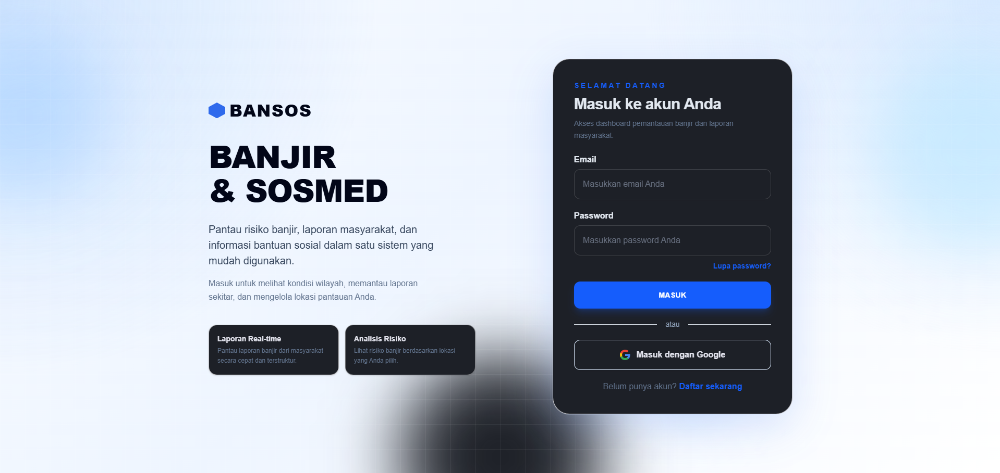
</p>

- Register Page

<p align="center">
  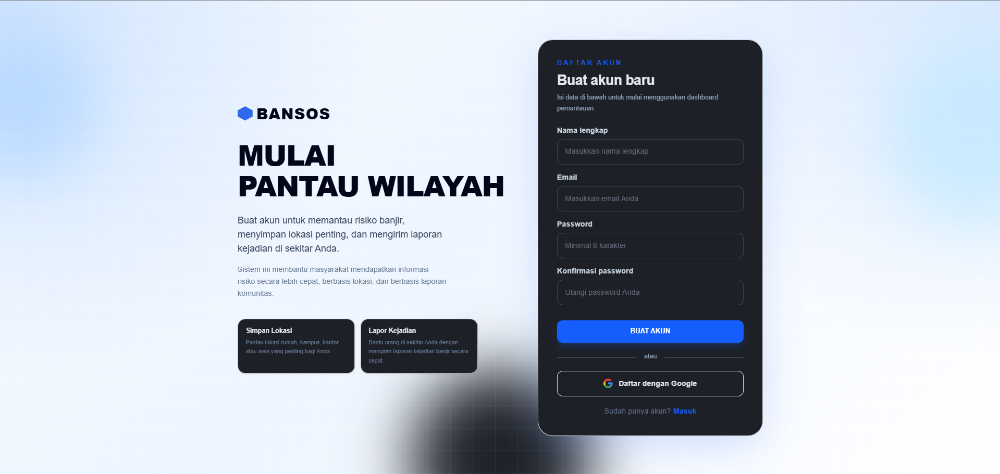
</p>

- Admin Login Page

<p align="center">
  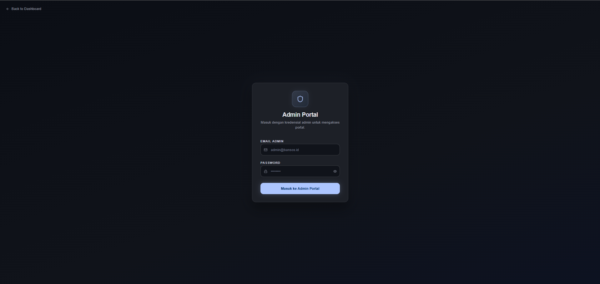
</p>

---

### 🏠 User Side Interface

- Dashboard Page

<p align="center">
  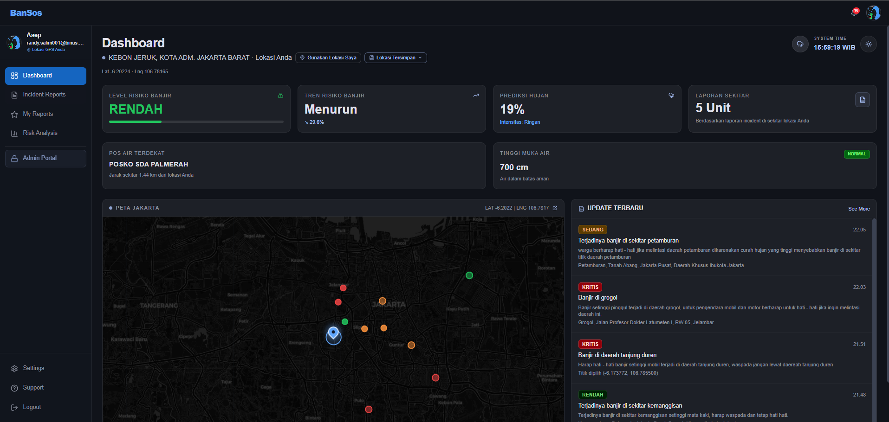
</p>

- Map Page

<p align="center">
  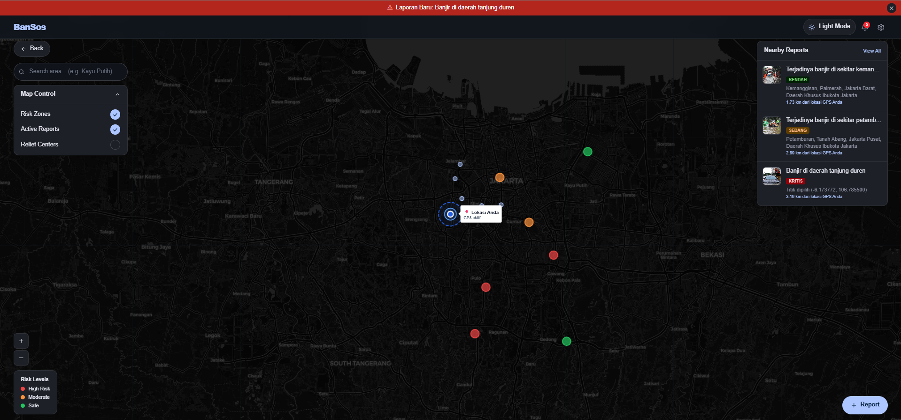
</p>

- Incident Reports Page

<p align="center">
  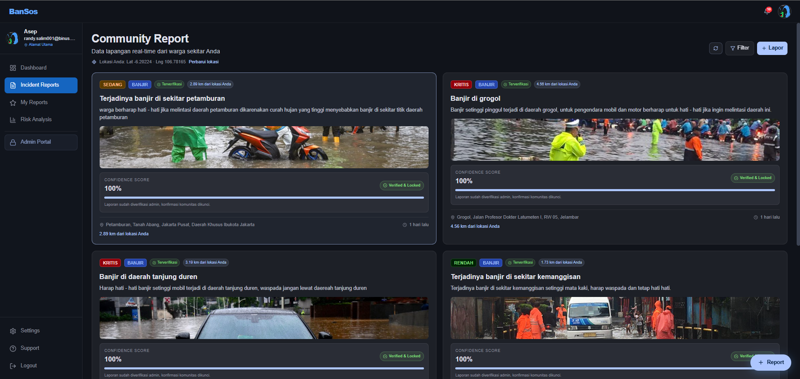
</p>

- Create Report Page

<p align="center">
  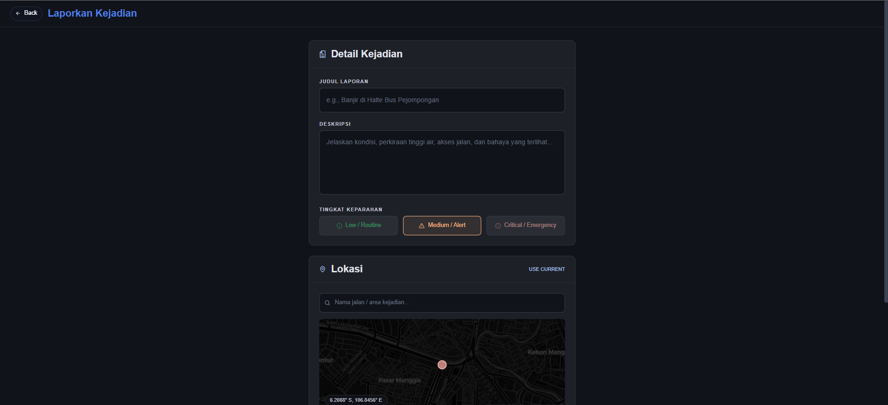
</p>

- My Reports Page

<p align="center">
  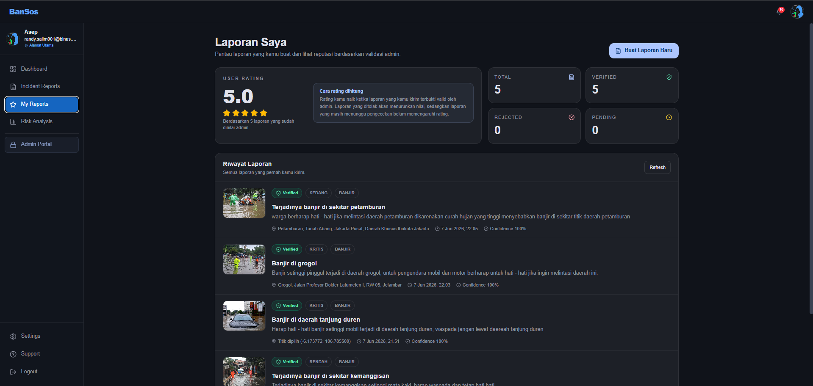
</p>

- Risk Analysis Page

<p align="center">
  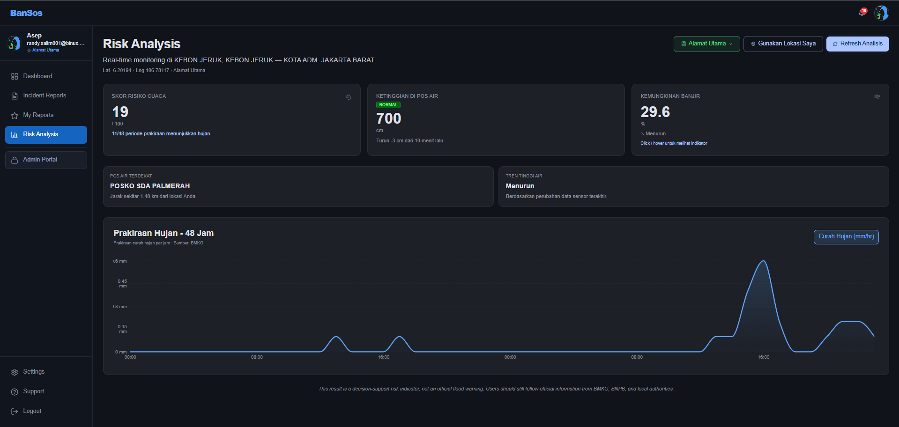
</p>

- Settings Page

<p align="center">
  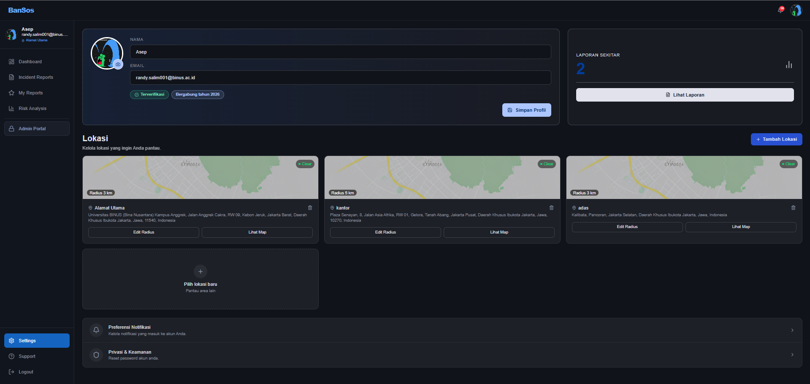
</p>

---

### 🛠 Admin Side Interface

- Admin Dashboard Page

<p align="center">
  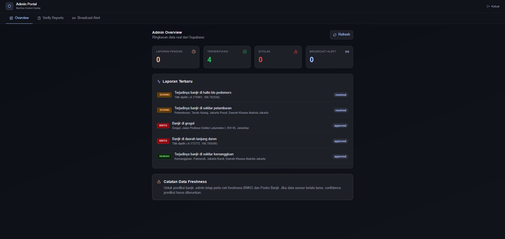
</p>

---

## ⚙ Technology Stack

### 🎨 Frontend

- React — library utama untuk membangun tampilan website.
- Vite — build tool dan development server.
- TypeScript — membantu membuat code lebih aman dan mudah dikelola.
- Tailwind CSS — digunakan untuk styling tampilan website.
- React Router — mengatur routing antar halaman.
- Leaflet dan React Leaflet — menampilkan peta yang interaktif.
- Supabase Client — menghubungkan frontend dengan Supabase.
- Lucide React — icon.
- Radix UI — komponen UI tambahan.
- Recharts — chart dan visualisasi data.

### ⚡ Backend

- FastAPI — framework utama untuk membuat backend API.
- Python — bahasa utama yang digunakan di backend khususnya di FastAPI.
- Uvicorn — server untuk menjalankan backend FastAPI.
- Pandas — pengolahan data.
- GeoPandas — pengolahan data geospasial.
- Shapely — operasi geometri dan koordinat.
- Requests — mengambil data dari API eksternal.
- Supabase Python Client — menghubungkan backend dengan Supabase.

### 🗄️ Database & Services

- Supabase Authentication — login, register, verifikasi email, dan reset password.
- Supabase Database — menyimpan data aplikasi seperti reports, saved locations, dan broadcast alerts.
- Supabase Storage — menyimpan media laporan seperti foto atau video.
- Supabase Row Level Security — mengatur akses data agar lebih aman.
- Open-Meteo API — mengambil data prakiraan hujan/cuaca.

### 🌐 Deployment

- Frontend: Vercel
- Backend: Hugging Face Spaces menggunakan Docker
- Database/Auth/Storage: Supabase
  
---

## 🧩 Software Engineering Process

Project BanSos dikembangkan menggunakan pendekatan Agile/Scrum sederhana. Selama proses pengerjaan, fitur dibagi ke dalam beberapa backlog dan dikerjakan secara bertahap melalui sprint. Pendekatan ini digunakan supaya pembagian tugas lebih jelas, progress lebih mudah dipantau, dan setiap fitur bisa diuji sebelum digabungkan ke versi utama project.

Dalam project ini, tim membagi pekerjaan ke beberapa area utama, yaitu frontend, backend, database, authentication, report system, risk analysis, admin verification, dan deployment.

---

### 📋 Product Backlog

Product backlog berisi daftar fitur utama yang direncanakan dalam project BanSos. Backlog ini menjadi target tim untuk menentukan prioritas pengembangan.

| No | Backlog Item             | Description                                                                                 | Priority |
| -- | ------------------------ | ------------------------------------------------------------------------------------------- | -------- |
| 1  | User Authentication      | User dapat register, login, verifikasi email, dan reset password menggunakan Supabase Auth. | High     |
| 2  | Dashboard                | User dapat melihat lokasi yang dipilih, status risiko banjir, dan laporan sekitar.          | High     |
| 3  | Interactive Map          | Website menampilkan peta interaktif untuk melihat lokasi user dan laporan banjir terdekat.  | High     |
| 4  | Incident Report System   | User dapat membuat laporan banjir dengan lokasi, severity, deskripsi, dan media pendukung.  | High     |
| 5  | Report Media Upload      | User dapat upload foto/video sebagai bukti laporan banjir.                                  | High     |
| 6  | Risk Analysis            | Sistem dapat menampilkan analisis risiko banjir berdasarkan koordinat lokasi.               | High     |
| 7  | Saved Locations          | User dapat menyimpan lokasi penting seperti rumah, kampus, kantor, atau lokasi lain.        | Medium   |
| 8  | My Reports               | User dapat melihat laporan yang pernah dibuat dan melihat status kontribusinya.             | Medium   |
| 9  | Admin Verification       | Admin dapat approve atau reject laporan yang masuk dari user.                               | High     |
| 10 | Broadcast Alert          | Admin dapat mengirim peringatan ke area tertentu berdasarkan lokasi dan radius.             | Medium   |
| 11 | Notification Preferences | User dapat mengatur jenis notifikasi yang ingin diterima.                                   | Medium   |
| 12 | Light/Dark Mode          | Website mendukung tampilan light mode dan dark mode.                                        | Low      |
| 13 | Deployment               | Frontend, backend, dan Supabase dapat berjalan di production environment.                   | High     |

---

### 🏃 Sprint Backlog

Sprint backlog digunakan untuk membagi pekerjaan menjadi task yang lebih kecil. Setiap sprint berfokus pada fitur tertentu agar proses development lebih terarah.

#### Sprint 1 - Project Setup & Basic Structure

| Task            | Description                                                      | Status |
| --------------- | ---------------------------------------------------------------- | ------ |
| Setup frontend  | Membuat project React, Vite, TypeScript, dan Tailwind CSS.       | Done   |
| Setup backend   | Membuat struktur awal backend menggunakan FastAPI.               | Done   |
| Setup Supabase  | Menyiapkan Supabase untuk Authentication, Database, dan Storage. | Done   |
| Setup routing   | Membuat routing dasar untuk halaman utama website.               | Done   |
| Setup UI layout | Membuat layout awal untuk login, dashboard, dan halaman utama.   | Done   |

#### Sprint 2 - Authentication & User Flow

| Task               | Description                                                         | Status |
| ------------------ | ------------------------------------------------------------------- | ------ |
| Register and login | Menghubungkan register dan login dengan Supabase Auth.              | Done   |
| Email verification | Menambahkan alur verifikasi email untuk user baru.                  | Done   |
| Reset password     | Menambahkan forgot password dan reset password page.                | Done   |
| Session handling   | Mengatur session user agar tetap terbaca setelah refresh.           | Done   |
| Protected routes   | Membatasi akses halaman tertentu hanya untuk user yang sudah login. | Done   |

#### Sprint 3 - Report System, Map, and Risk Analysis

| Task                 | Description                                                      | Status |
| -------------------- | ---------------------------------------------------------------- | ------ |
| Incident report form | Membuat form untuk laporan banjir dari user.                     | Done   |
| Media upload         | Menambahkan upload foto/video laporan ke Supabase Storage.       | Done   |
| Interactive map      | Menampilkan peta interaktif menggunakan Leaflet.                 | Done   |
| Nearby reports       | Menampilkan laporan banjir berdasarkan lokasi user.              | Done   |
| Risk analysis        | Menampilkan analisis risiko banjir berdasarkan koordinat lokasi. | Done   |
| Saved locations      | User dapat menyimpan dan memilih lokasi penting.                 | Done   |

#### Sprint 4 - Admin Features

| Task            | Description                                                           | Status |
| --------------- | --------------------------------------------------------------------- | ------ |
| Admin portal    | Membuat halaman khusus admin untuk melihat ringkasan data.            | Done   |
| Verify reports  | Admin dapat approve laporan yang valid.                               | Done   |
| Reject reports  | Admin dapat reject laporan dengan alasan penolakan.                   | Done   |
| Broadcast alert | Admin dapat membuat peringatan berdasarkan lokasi dan radius.         | Done   |
| Admin overview  | Menampilkan total laporan pending, approved, rejected, dan broadcast. | Done   |

#### Sprint 5 - Finalization & Deployment

| Task                    | Description                                                              | Status |
| ----------------------- | ------------------------------------------------------------------------ | ------ |
| UI improvement          | Memperbaiki tampilan agar nyaman di light mode dan dark mode.            | Done   |
| Bug fixing              | Memperbaiki error pada report, map, reset password, dan saved locations. | Done   |
| Supabase schema cleanup | Merapikan tabel, relasi, dan policy yang digunakan.                      | Done   |
| Frontend deployment     | Deploy frontend menggunakan Vercel.                                      | Done   |
| Backend deployment      | Deploy backend menggunakan Hugging Face Spaces.                          | Done   |
| Documentation           | Membuat README sebagai dokumentasi GitHub project.                       | Done   |

---

### 🔄 Development Workflow

Selama pengerjaan project, tim menggunakan GitHub untuk menyimpan source code dan mengatur perubahan yang dibuat oleh setiap anggota. Setiap perubahan fitur atau perbaikan dilakukan melalui branch agar tidak langsung mengganggu branch utama.

Workflow yang digunakan:

1. Membuat branch baru untuk fitur atau bug fix.
2. Mengembangkan fitur di local environment.
3. Melakukan testing secara local.
4. Commit perubahan dengan pesan yang jelas.
5. Push branch ke GitHub.
6. Membuat pull request ke branch utama.
7. Melakukan pengecekan sebelum merge.
8. Deploy perubahan ke environment production jika sudah aman.

Contoh branch yang digunakan selama development:

```txt
frontend-vercel-deploy
commit1-update-fix
commit2-update
```

---

### ✅ Testing Process

Testing dilakukan secara manual dengan mencoba alur utama dari sisi user dan admin. Pengujian ini dilakukan untuk memastikan fitur yang dibuat sudah sesuai dengan kebutuhan dan tidak menyebabkan error pada flow utama aplikasi.

| Test Case              | Expected Result                                                  |
| ---------------------- | ---------------------------------------------------------------- |
| User register          | Akun user berhasil dibuat dan masuk ke Supabase Auth.            |
| User login             | User berhasil masuk ke dashboard.                                |
| Email verification     | User dapat melakukan verifikasi email.                           |
| Forgot password        | Link reset password terkirim ke email user.                      |
| Reset password         | User dapat membuat password baru melalui halaman reset password. |
| Create incident report | Laporan banjir berhasil dibuat dan masuk ke database.            |
| Upload report media    | Foto/video laporan berhasil tersimpan di Supabase Storage.       |
| View nearby reports    | User dapat melihat laporan di sekitar lokasi yang dipilih.       |
| Saved locations        | User dapat menambah, memilih, dan menghapus lokasi tersimpan.    |
| Risk analysis          | Sistem menampilkan hasil analisis risiko berdasarkan lokasi.     |
| Admin approve report   | Laporan berubah menjadi approved dan dapat ditampilkan ke user.  |
| Admin reject report    | Laporan berubah menjadi rejected dengan alasan penolakan.        |
| Broadcast alert        | Admin dapat membuat alert berdasarkan lokasi dan radius.         |
| Light/Dark mode        | Tampilan tetap terbaca dan nyaman di kedua mode.                 |

---

### 🚢 Deployment Flow

Project ini menggunakan deployment terpisah antara frontend, backend, dan database.

Frontend dideploy menggunakan Vercel karena mudah dihubungkan dengan GitHub dan cocok untuk project React + Vite. Backend dideploy menggunakan Hugging Face Spaces dengan Docker untuk menjalankan FastAPI. Supabase digunakan sebagai layanan cloud untuk Authentication, Database, dan Storage.

Alur deployment:

1. Frontend di-push ke GitHub dan dihubungkan ke Vercel.
2. Environment variables frontend ditambahkan di Vercel.
3. Backend disiapkan dengan `Dockerfile`, `requirements.txt`, dan konfigurasi FastAPI.
4. Backend dideploy ke Hugging Face Spaces.
5. URL backend dimasukkan ke environment variable frontend.
6. Supabase dikonfigurasi melalui dashboard, termasuk database schema, auth redirect URL, dan storage bucket.
7. Website dicoba kembali melalui production URL.

---

## 📁 Folder Structure

Struktur utama project ini seperti berikut:

```txt
BanSos/
├── backend/
│   ├── datasource/
│   │   ├── clean/
│   │   ├── processed/
│   │   └── raw/
│   ├── src/
│   │   ├── api/
│   │   │   └── main.py
│   │   ├── database/
│   │   │   └── supabase_client.py
│   │   ├── data_cleaning/
│   │   ├── feature_engineering/
│   │   └── risk_engine/
│   ├── Dockerfile
│   ├── requirements.txt
│   └── README.md
│
├── docs/
│   └── images/
│       ├── adminDashboard.png
│       ├── adminLogin.png
│       ├── createReport.png
│       ├── dashboardPage.png
│       ├── incidentReports.png
│       ├── loginPage.png
│       ├── mapPage.png
│       ├── myReports.png
│       ├── registerPage.png
│       ├── riskAnalysis.png
│       └── settingPage.png
│
├── frontend/
│   ├── src/
│   │   ├── app/
│   │   │   ├── components/
│   │   │   ├── context/
│   │   │   ├── data/
│   │   │   ├── pages/
│   │   │   ├── routes/
│   │   │   ├── services/
│   │   │   └── utils/
│   │   ├── styles/
│   │   └── main.tsx
│   ├── index.html
│   ├── package.json
│   ├── tsconfig.json
│   ├── vercel.json
│   └── vite.config.ts
│
├── supabase/
│   └── schema.sql
│
├── ATTRIBUTIONS.md
├── .gitignore
└── README.md
```
Penjelasan singkat:

- `frontend/` berisi semua code tampilan website.
- `backend/` berisi API FastAPI untuk risk analysis, reports, saved locations, notifications, dan admin features.
- `backend/datasource/` berisi data banjir yang dipakai untuk proses analisis risiko.
- `docs/images/` berisi screenshot atau mockup tampilan aplikasi yang digunakan di README.
- `supabase/schema.sql` berisi query SQL untuk membuat tabel dan konfigurasi database Supabase.

---

## ✅ Prerequisites

Sebelum menjalankan project, pastikan beberapa tools berikut sudah tersedia:

- Node.js 16+
- Git
- Python 3.10+
- Supabase account

---

## 🛠️ How to Install and Run Locally

### 1. Clone Repository

```bash
git clone https://github.com/username/nama-repository.git
cd nama-repository
```

Ganti `username/nama-repository` dengan repository GitHub yang dipakai.

---

## Menjalankan Frontend

Masuk ke folder frontend:

```bash
cd frontend
```

Install dependency:

```bash
npm install
```

Buat file `.env` di dalam folder `frontend/`:

```env
VITE_API_BASE_URL=http://localhost:8000
VITE_SUPABASE_URL=your_supabase_project_url
VITE_SUPABASE_ANON_KEY=your_supabase_anon_key
```

Jalankan frontend:

```bash
npm run dev
```

Biasanya frontend akan berjalan di:

```txt
http://localhost:5173
```

---

## Menjalankan Backend

Masuk ke folder backend:

```bash
cd backend
```

Buat virtual environment:

```bash
python -m venv .venv
```

Aktifkan virtual environment.

Untuk Windows:

```bash
.venv\Scripts\activate
```

Untuk macOS/Linux:

```bash
source .venv/bin/activate
```

Install dependency:

```bash
pip install -r requirements.txt
```

Buat file `.env` di dalam folder `backend/`:

```env
SUPABASE_URL=your_supabase_project_url
SUPABASE_SERVICE_ROLE_KEY=your_supabase_service_role_key
CORS_ORIGINS=http://localhost:5173
```

Jalankan backend:

```bash
uvicorn src.api.main:app --reload
```

Biasanya backend akan berjalan di:

```txt
http://localhost:8000
```

Untuk mengecek backend hidup atau tidak, buka:

```txt
http://localhost:8000/
```

Jika berhasil, akan muncul response seperti:

```json
{
  "message": "BANSOS Flood Risk API is running."
}
```

---

## 🔐 Environment Variables

### Frontend `.env`

File ini dibuat di folder `frontend/`.

```env
VITE_API_BASE_URL=
VITE_SUPABASE_URL=
VITE_SUPABASE_ANON_KEY=
```

Keterangan:

- `VITE_API_BASE_URL` adalah URL backend FastAPI.
- `VITE_SUPABASE_URL` adalah URL project Supabase.
- `VITE_SUPABASE_ANON_KEY` adalah public anon key dari Supabase.

Contoh local:

```env
VITE_API_BASE_URL=http://localhost:8000
VITE_SUPABASE_URL=https://your-project.supabase.co
VITE_SUPABASE_ANON_KEY=your_anon_key
```

### Backend `.env`

File ini dibuat di folder `backend/`.

```env
SUPABASE_URL=
SUPABASE_SERVICE_ROLE_KEY=
CORS_ORIGINS=
```

Keterangan:

- `SUPABASE_URL` adalah URL project Supabase.
- `SUPABASE_SERVICE_ROLE_KEY` adalah service role key dari Supabase. Key ini hanya boleh dipakai di backend.
- `CORS_ORIGINS` berisi daftar domain frontend yang boleh mengakses backend.

Contoh local:

```env
SUPABASE_URL=https://your-project.supabase.co
SUPABASE_SERVICE_ROLE_KEY=your_service_role_key
CORS_ORIGINS=http://localhost:5173
```

Jika sudah deploy frontend, isi `CORS_ORIGINS` dengan domain production juga, misalnya:

```env
CORS_ORIGINS=https://nama-project.vercel.app
```

Kalau ada lebih dari satu domain, pisahkan dengan koma:

```env
CORS_ORIGINS=http://localhost:5173,https://nama-project.vercel.app
```

> Jangan upload file `.env` ke GitHub. Simpan `.env` hanya di local atau di environment variables platform deployment.

---

## 🗄️Information Supabase

Project ini memakai Supabase untuk auth, database, dan storage.

### 🔑 1. Authentication

Supabase Auth dipakai untuk:

- Register user
- Login user
- Verify email
- Reset password
- Session user

### 🧾 2. Database

File database ada di:

```txt
supabase/schema.sql
```

Jalankan isi file tersebut di Supabase SQL Editor untuk membuat tabel yang dibutuhkan.

Tabel utama yang dipakai:

- `reports` untuk menyimpan laporan banjir dari user.
- `report_media` untuk menyimpan URL foto/video pendukung laporan.
- `report_verifications` untuk menyimpan keputusan admin terhadap laporan.
- `broadcast_alerts` untuk menyimpan alert yang dibuat admin.
- `saved_locations` untuk menyimpan lokasi favorit user.
- `notification_preferences` untuk menyimpan pengaturan notifikasi user.

Backend juga memiliki fitur voting/konfirmasi laporan. Jika fitur confirm/deny dipakai, pastikan tabel `report_votes` juga tersedia di Supabase karena backend membaca dan menyimpan vote laporan melalui tabel tersebut.

### 🗂️ 3. Storage

Project ini memakai Supabase Storage untuk menyimpan media laporan.

Bucket yang digunakan:

```txt
report-media
```

File `schema.sql` sudah menyiapkan bucket `report-media` sebagai public bucket dan membuat policy untuk public read media.

Upload media dilakukan lewat backend menggunakan service role key, jadi service role key hanya boleh disimpan di backend, bukan di frontend.

---

## 📍 Project Status

Project ini dibuat untuk kebutuhan Software Engineering dengan fokus pada sistem informasi risiko banjir, laporan komunitas, dan admin verification. Sistem ini masih bisa dikembangkan lagi, terutama untuk real-time notification, role management yang lebih rapi, dan integrasi data banjir yang lebih lengkap.

---

## 👥 Contributors

1. Randy Salim
2. Dzaky Rizha Anargya
3. Jevon Justin
4. Alif Akbar Hafiz

---
